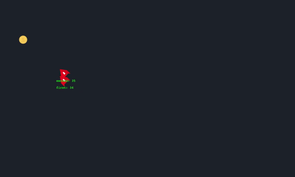

# Phaser3 Multiplayer Game

### Usage

Make sure to have node.js installed.
Install the dependencies and start both dev servers.

```sh
$ npm install
$ npm run dev
```
Open multiple client tabs to play.

For production environments...

```sh
$ npm run build
$ npm run server
```
### Access deployed game
###### https://www.phasershooter.com
